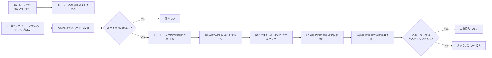

# 30 Route Performance ロジック説明

## 目的

10 で作成したルート上のポイントを「バケツ」として使い、20 で抽出したトリップをルートごと、方向ごと、日付・時間帯ごとに集計します。

## バケツ投入の考え方

## 方向判定

ルート設定時の点の並びを順方向とします。GPS 点をルートへ投影した累積距離を `s` とすると、連続する2点で `s2 > s1` なら順方向、`s2 < s1` なら逆方向です。

## 欠落バケツを作らない処理

GPS 点そのものがバケツの近くに無くても、前後のGPS点を結んだ線分がルート上で複数のバケツをまたぐ場合は、その間のバケツを連続して投入します。

例: あるトリップ区間が KP 1.0km から KP 1.4km へ進んだ場合、その間にある 1.1km、1.2km、1.3km、1.4km のバケツへ連続投入します。

## 二重投入防止

内部で `(route, trip, bucket)` に相当する投入済みキーを持ちます。同じトリップが同じルートの同じバケツへ再度入ろうとした場合は捨てます。これにより折り返しやGPS揺れで交通量が水増しされることを防ぎます。

同じトリップが複数ルートを走る場合は、ルートが異なるため、それぞれのルートに投入されます。

## 集計値

- 速度: ETC2.0 の瞬間速度ではなく、前後GPS点のルート上距離差とGPS時刻差から `abs(s2 - s1) / seconds * 3.6` で算出します。
- 時間帯: バケツKPを通過した時刻を `t1 + (KP - s1) / (s2 - s1) * (t2 - t1)` で按分して決めます。
- 交通量: 実トリップ数に、UIで路線ごとに設定した拡大係数を掛けます。
